# MCP-Server, AI Agent, and External Tool Integration
## Overview
This assignment builds an integrated AI Agent ecosystem using the **Model Context Protocol (MCP)**.  
The agent is capable of managing real-world schedules via Google Calendar and communicating  
through Telegram, demonstrating practical Natural Language Understanding (NLU).

**Stack used:**
- n8n (local, via Docker)
- ngrok (tunnel to expose local server)
- Groq API (free LLM — llama-3.3-70b-versatile)
- Telegram Bot API
- Google Calendar API

---

## Repository Structure
```
MCP-Server-AI-Agent-and-External-Tool-Integration/
│
├── README.md
│
├── screenshots/
│   │   ├── docker_running.png
│   │   ├── MCP_server_trigger_with_AI_clint_result.png
│   │   ├── ai_agent_workflow_for_telegram_and_calender.png
│   │   ├── mcp_server_workflow.png
│   │   ├── ai_clint_workflow.png
│   │   ├── other images related to results
│
└── workflows/
    ├── AI workflow.json
    ├── Server Trigger.json
    └── Telegram & Google Calendar Integration.json
```
---
## 1: MCP Infrastructure & Server Setup
### 1.1 Server Deployment

- Deployed **n8n** locally using **Docker**
- Used **ngrok** to expose the local server to the internet via a public HTTPS URL
- The Production URL follows the format: `https://[ngrok-subdomain].ngrok-free.app/mcp/a7-server`

**Text Formatter Tool:**  
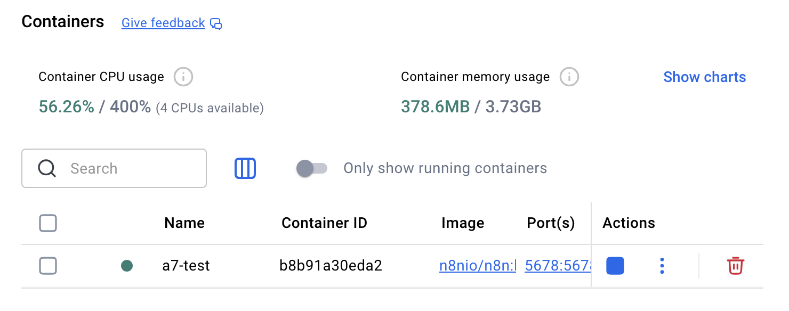
       
---
### 1.2 MCP Server Workflow

Created an n8n workflow acting as an **MCP Server** with an MCP Server Trigger node  
and three internal tools:

| Tool | Description |
|------|-------------|
| **Calculator** | Performs arithmetic calculations |
| **Date & Time** | Returns current date, time, day, and timezone |
| **Text Formatter** | Formats text (uppercase, lowercase, capitalize, reverse, word count) |

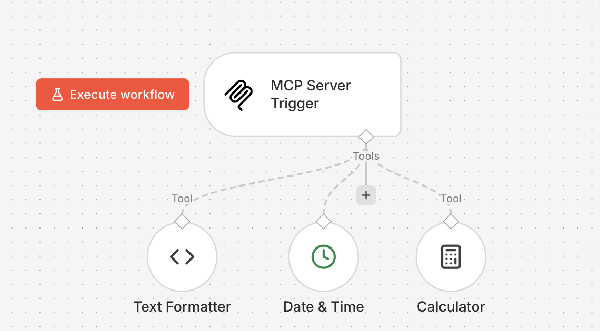


---
### 1.3 AI Agent Client

Created a separate **AI Agent** workflow with:
- **Groq** as the LLM provider (free model: `llama-3.3-70b-versatile`)
- **Window Buffer Memory** for maintaining conversation context
- **MCP Client (Tool)** connected to the MCP Server Production URL

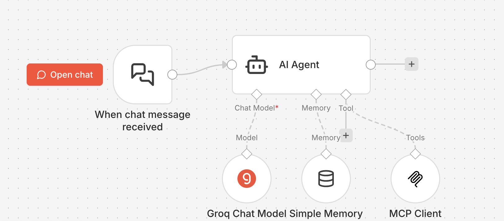


#### Verification — Agent using MCP tools via chat:
** AI Agent Client communication with MCP server:**  
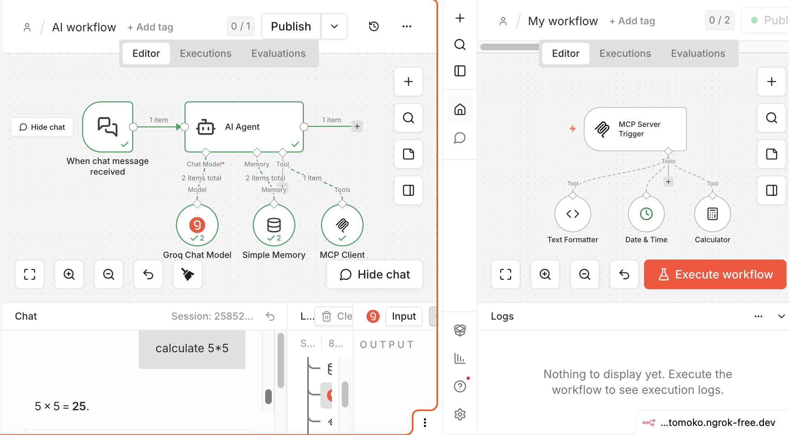

**Calculator Tool:**  
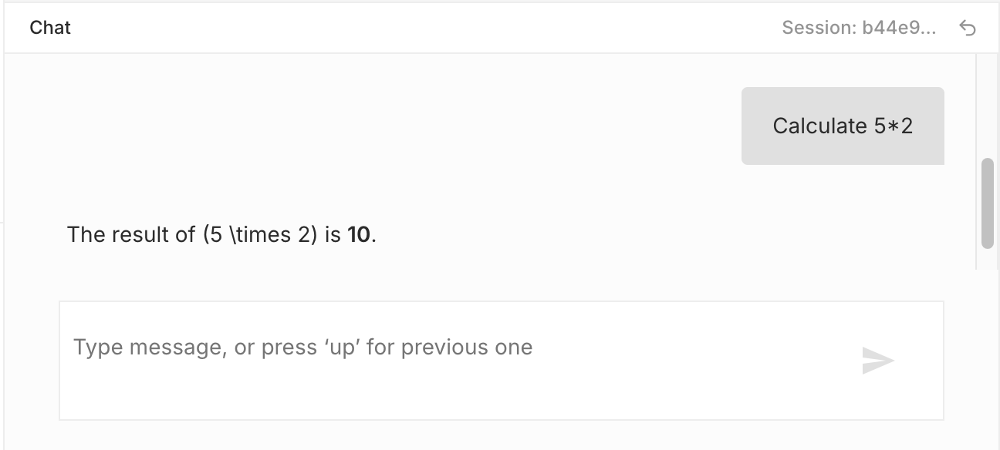

**Date & Time Tool:**  
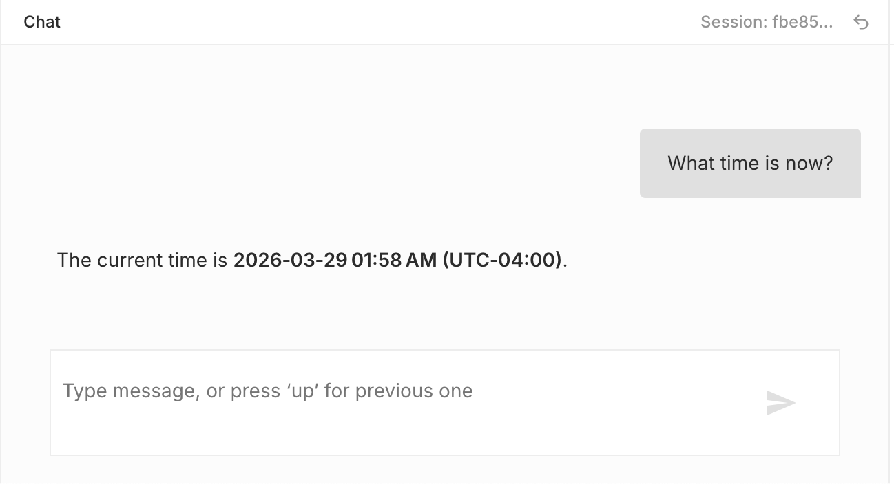

**Text Formatter Tool:**  
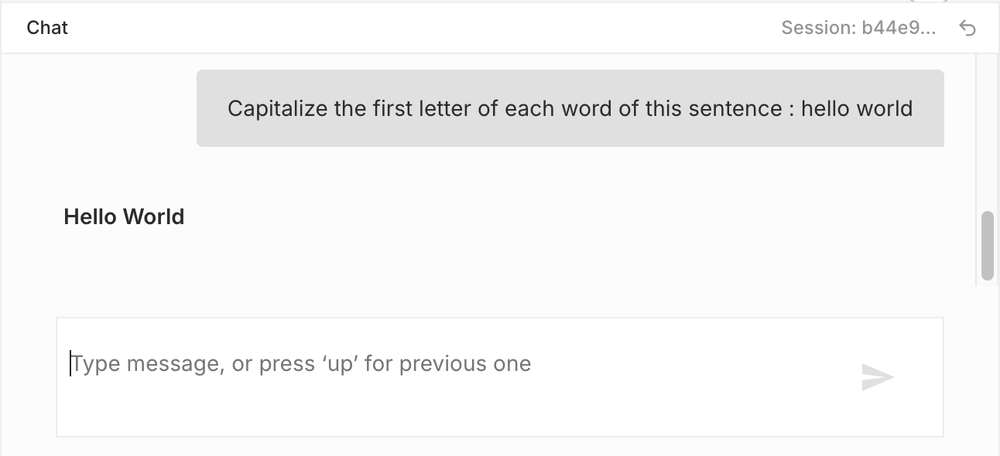

---

## 2: Telegram & Google Calendar Integration

### 2.1 Telegram Bot

- Created a Telegram Bot using **@BotFather**
- Added a **Telegram Trigger** node to the AI Agent workflow
- The agent receives messages from Telegram and replies directly in the chat

### 2.2 Google Calendar Tool

- Integrated **Google Calendar** using OAuth2 credentials in n8n
- The agent can **create, read, and manage** calendar events via natural language

### 2.3 Automated Project Scheduling

Sent the following command to the Telegram bot:

> *"Create a project schedule with 4 phases: Literature Review, Project Proposal,  
> Update Progress, and Final Presentation"*

The agent automatically created **4 events** in Google Calendar:

| Phase | Event |
|-------|-------|
| 1st | Literature Review |
| 2nd | Project Proposal |
| 3rd | Update Progress |
| 4th | Final (Presentation) |

**Telegram conversation:**  
<div style="display: flex; gap: 10px; flex-wrap: wrap;">
  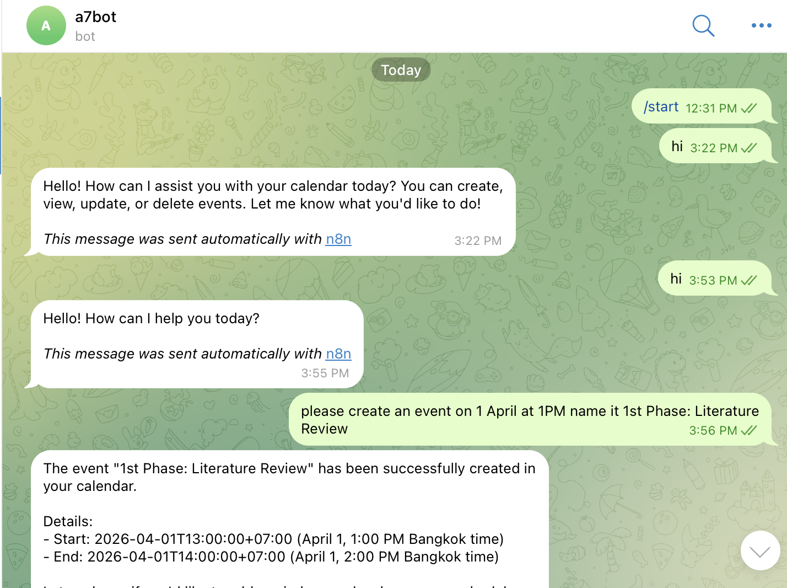
  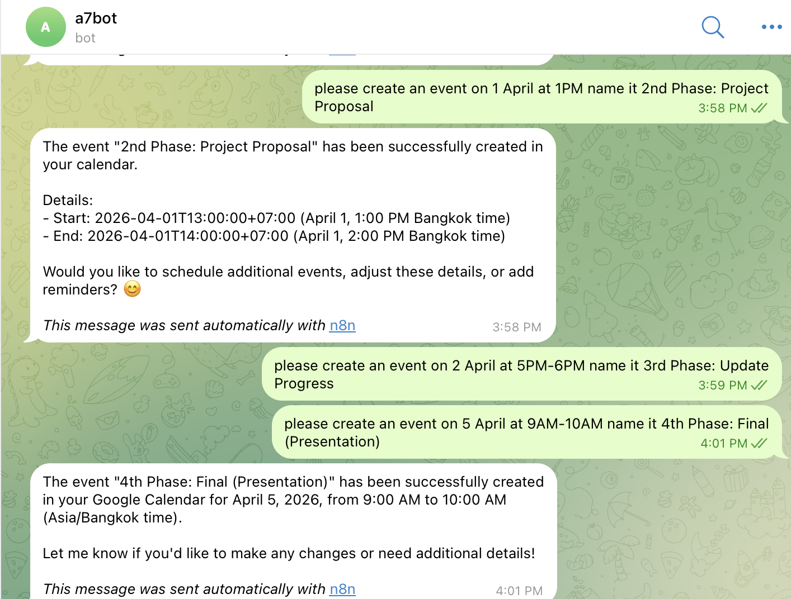
</div>

**Google Calendar result:**  
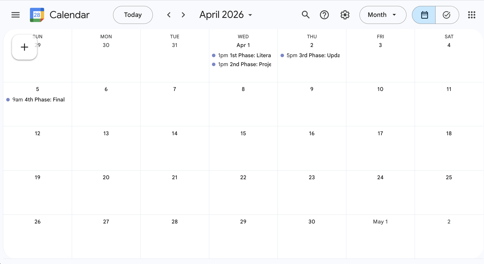

### 2.4 Interaction Verification

Asked the bot via Telegram to verify the project phases on the calendar.  
The agent successfully queried Google Calendar and confirmed all 4 events.
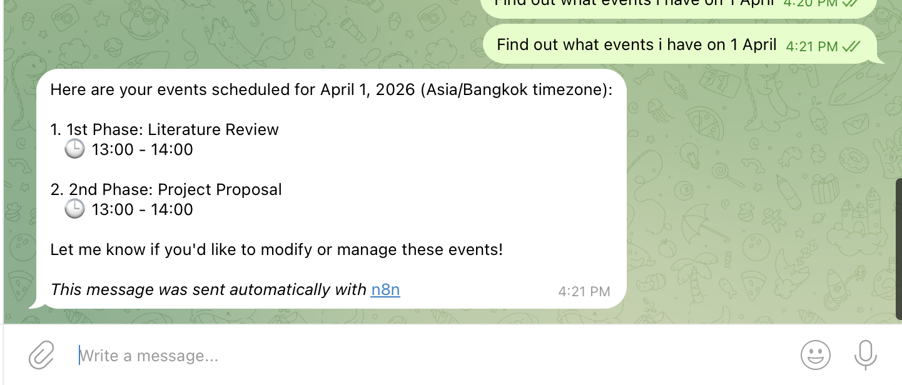
       
---

## Workflow Files

The exported n8n workflow JSON files are available in the `/workflows` folder.

> **Note:** All credentials (API keys, tokens, OAuth) have been removed from  
> the exported files for security. To run these workflows, add your own  
> credentials inside n8n.

- [MCP Server Workflow](workflows/Server Trigger.json)
- [AI Agent Workflow](workflows/AI workflow.json)
- [Telegram & Google Calendar Integration Workflow](workflows/Telegram & Google Calendar Integration.json)
---

## Setup Instructions

### Prerequisites
- [Docker Desktop](https://www.docker.com/products/docker-desktop/)
- [ngrok](https://ngrok.com/) account (free)
- [Groq API key](https://console.groq.com/) (free)
- Telegram account + Bot Token via [@BotFather](https://t.me/BotFather)
- Google account with Calendar access

### Running n8n locally
```bash
docker run -it --rm \
  --name n8n \
  -p 5678:5678 \
  -v ~/.n8n:/home/node/.n8n \
  -e N8N_TRUST_PROXY=true \
  n8nio/n8n
```

### Exposing with ngrok
```bash
ngrok http 5678
```

Copy the HTTPS URL and update it in the MCP Client node inside n8n.

### Credentials needed in n8n
| Credential | Where to get it |
|------------|----------------|
| Groq API Key | [console.groq.com](https://console.groq.com) |
| Telegram Bot Token | [@BotFather](https://t.me/BotFather) on Telegram |
| Google OAuth2 | Google Cloud Console |

---

## References

### Official Documentation
- [n8n Documentation](https://docs.n8n.io/) — Official n8n docs for nodes, workflows, and credentials
- [n8n MCP Server Trigger Node](https://docs.n8n.io/integrations/builtin/cluster-nodes/root-nodes/n8n-nodes-langchain.mcptrigger/) — MCP Server Trigger setup guide
- [n8n AI Agent Node](https://docs.n8n.io/integrations/builtin/cluster-nodes/root-nodes/n8n-nodes-langchain.agent/) — AI Agent node documentation
- [n8n MCP Client Tool](https://docs.n8n.io/integrations/builtin/cluster-nodes/sub-nodes/n8n-nodes-langchain.mcpclienttool/) — MCP Client tool documentation
- [n8n Telegram Trigger](https://docs.n8n.io/integrations/builtin/trigger-nodes/n8n-nodes-base.telegramtrigger/) — Telegram Trigger node documentation
- [n8n Google Calendar Node](https://docs.n8n.io/integrations/builtin/app-nodes/n8n-nodes-base.googlecalendar/) — Google Calendar integration guide
- [n8n Memory Buffer Window](https://docs.n8n.io/integrations/builtin/cluster-nodes/sub-nodes/n8n-nodes-langchain.memorybufferwindow/) — Window Buffer Memory documentation

### Model Context Protocol (MCP)
- [MCP Official Documentation](https://modelcontextprotocol.io/introduction) — Introduction to Model Context Protocol
- [MCP Specification](https://spec.modelcontextprotocol.io/) — Full MCP specification

### Tools & Services
- [Docker Desktop](https://www.docker.com/products/docker-desktop/) — Container platform used to run n8n locally
- [ngrok Documentation](https://ngrok.com/docs/) — Tunneling tool to expose local server to internet
- [Groq Console](https://console.groq.com/) — Free LLM API provider (used: qwen/qwen3-32b)
- [Telegram BotFather](https://core.telegram.org/bots#botfather) — Official tool for creating Telegram bots
- [Telegram Bot API](https://core.telegram.org/bots/api) — Telegram Bot API documentation
- [Google Calendar API](https://developers.google.com/calendar/api/guides/overview) — Google Calendar API overview

### Course Materials
- [AT82.05 Course GitHub Repository](https://github.com/chaklam-silpasuwanchai/Python-fo-Natural-Language-Processing/tree/main/Code/11%20-%20Agentic%20AI/local-n8n) — Environment setup and footprints provided by instructor
- Chaklam Silpasuwanchai and Todsavad Tangtortan, *AT82.05 Artificial Intelligence: Natural Language Understanding — Assignment 7: MCP-Server, AI Agent, and External Tool Integration*, Asian Institute of Technology, March 2026
